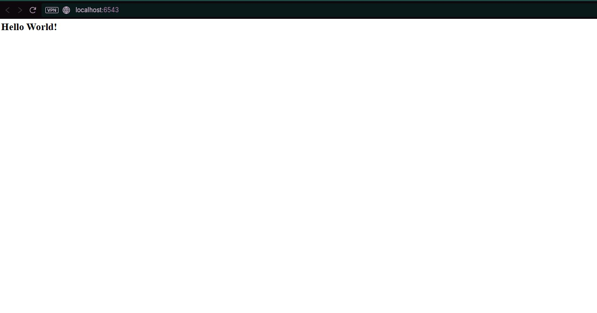

# 01: Single-File Web Applications

## Tujuan
Tujuan dari langkah pertama ini adalah untuk mendapatkan aplikasi web Pyramid yang berjalan sesederhana mungkin menggunakan hanya satu file Python (`app.py`), meniru perilaku sebuah microframework tanpa struktur paket yang kompleks.
Ini berfungsi sebagai basis yang dipahami dengan baik untuk menambahkan kompleksitas di langkah-langkah berikutnya.
Memberikan paparan awal pada konsep WSGI, Request, View, dan Response.

## Kode yang Dianalisis (`app.py`)
Kode tunggal yang menjalankan aplikasi:

```python
from waitress import serve
from pyramid.config import Configurator
from pyramid.response import Response

def hello_world(request):
    print('Incoming request')
    return Response('<body><h1>Hello World!</h1></body>')

if __name__ == '__main__':
    with Configurator() as config:
        config.add_route('hello', '/')
        config.add_view(hello_world, route_name='hello')
        app = config.make_wsgi_app()
    serve(app, host='0.0.0.0', port=6543)
```

## Hasil Aplikasi

Setelah menjalankan `$VENV/bin/python app.py` (atau yang setara di Windows) dan membuka `http://localhost:6543/` di browser:

- **Tampilan Browser:** Sebuah halaman web sederhana yang hanya menampilkan judul `<h1>Hello World!</h1>`. Contoh tampilan dapat dilihat pada gambar berikut:



- **Keluaran Konsol:** Setiap kali permintaan masuk, konsol akan menampilkan teks: `Incoming request`.

## Hasil Analisis Utama

| Baris Kode | Komponen Pyramid | Fungsi dan Analisis Utama |
|---|---|---|
| `def hello_world(request): ... return Response(...)` | View Callable | Ini adalah fungsi View yang merupakan controller di pola MVC. Ia menerima objek Request (input dari pengguna) dan harus mengembalikan objek Response (output HTML ke browser). |
| `from waitress import serve` | WSGI Server | Waitress adalah server HTTP yang digunakan untuk melayani aplikasi. Aplikasi Pyramid harus mengikuti standar WSGI (Web Server Gateway Interface) agar dapat plug-and-play dengan server standar. |
| `with Configurator() as config:` | Configurator | Objek sentral di Pyramid. Tugasnya adalah mengkonfigurasi dan menghubungkan semua komponen aplikasi secara eksplisit (bukan otomatis). |
| `config.add_route('hello', '/')` | Routing | Mendefinisikan jalur URL (/) dan memberinya nama simbolis (hello). Ini adalah langkah pertama dalam mencocokkan URL. |
| `config.add_view(hello_world, route_name='hello')` | View Registration | Menghubungkan fungsi hello_world ke rute yang telah didefinisikan (hello). Ini memberitahu Pyramid: "Ketika rute hello cocok, jalankan fungsi hello_world." |
| `app = config.make_wsgi_app()` | WSGI Application | Menyelesaikan konfigurasi dan membuat objek aplikasi WSGI yang siap untuk disajikan. |
| `serve(app, host='0.0.0.0', port=6543)` | Deployment | Menerbitkan aplikasi WSGI (app) menggunakan server Waitress pada port yang ditentukan. |

## Kesimpulan Fokus
Langkah ini berhasil menunjukkan bahwa Pyramid dapat berfungsi sebagai microframework yang ringan dan modular. Meskipun sederhana, ia sudah mengandung tiga elemen fundamental arsitektur Pyramid: WSGI, Configurator, dan View/Response. Pendekatan ini mendukung filosofi Pyramid yaitu "mulai dari yang kecil, tapi dapat diskalakan hingga besar."
