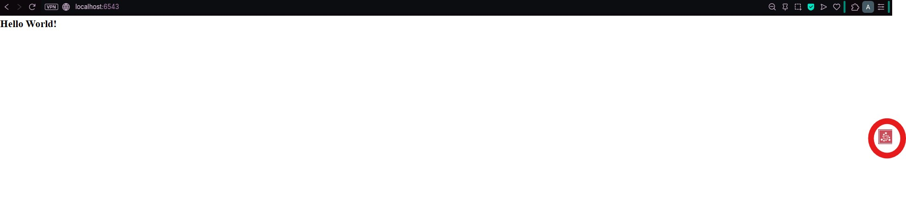
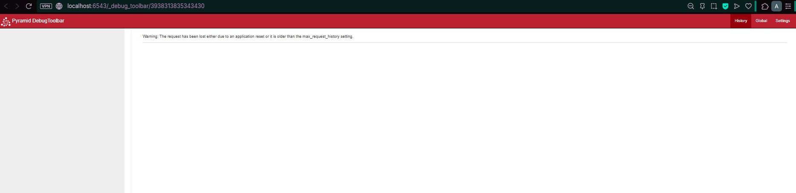

# 04: Easier Development with pyramid_debugtoolbar

## Tujuan
Langkah ini memperkenalkan cara menambahkan add-ons Pyramid untuk meningkatkan produktivitas pengembangan, khususnya menggunakan pyramid_debugtoolbar untuk debugging dan introspeksi aplikasi.

- Memahami dan mengimplementasikan Setuptools "Extras" (`extras_require`) untuk dependensi pengembangan.
- Menginstal add-on eksternal (`pyramid_debugtoolbar`).
- Mengkonfigurasi add-on Pyramid menggunakan direktif `pyramid.includes` di file `.ini`.

## Hasil Aplikasi Utama

Setelah menjalankan `pserve development.ini --reload` dan membuka `http://localhost:6543/`, aplikasi akan menampilkan halaman "Hello World!" yang sama dari langkah sebelumnya, tetapi dengan tambahan:

- **Ikon Toolbar Debug:** Sebuah ikon kecil muncul di sisi kanan browser.

- **Fungsi Introspeksi:** Klik ikon membuka panel dengan info debugging, request/response, konfigurasi, route, settings, dsb.


## Perubahan Kode dan Konfigurasi

### 1. setup.py: Menambahkan Extras (Dependensi Pengembangan)
Kita mendefinisikan dependensi pengembangan (`pyramid_debugtoolbar`) dalam bagian `extras_require` agar hanya terinstal saat diperlukan.

```python
# ...
dev_requires = [
    'pyramid_debugtoolbar',
]

setup(
    # ...
    install_requires=requires,
    extras_require={
        'dev': dev_requires, # Grup 'dev' untuk dependensi development
    },
    # ...
)
```

### 2. development.ini: Mengaktifkan Add-on
Kita mengaktifkan fungsionalitas add-on ini dengan menambahkannya ke direktif `pyramid.includes` di bagian konfigurasi aplikasi:

```ini
[app:main]
use = egg:tutorial
pyramid.includes = 
    pyramid_debugtoolbar
# ...
```

**Analisis:**
- Direktif `pyramid.includes` adalah cara deklaratif untuk memberi tahu Configurator Pyramid untuk memuat dan menjalankan konfigurasi dari paket eksternal (add-on) saat aplikasi dimulai.

## Analisis Konsep Utama

### 1. Setuptools Extras (`extras_require`)
- **Tujuan:** Memisahkan dependensi wajib (`install_requires`) dari dependensi opsional/bersyarat (seperti alat pengembangan).
- **Manfaat:** Dependensi berat atau spesifik-lingkungan (seperti debugger) tidak diinstal di production, menjaga aplikasi tetap ramping.

### 2. Mekanisme Add-on Pyramid
- **Instalasi Fisik:** Paket pyramid_debugtoolbar diinstal ke lingkungan Python melalui `pip install -e ".[dev]"`.
- **Inklusi Konfigurasi:** Baris `pyramid.includes = pyramid_debugtoolbar` menjalankan fungsi setup internal debugtoolbar di aplikasi Pyramid.

### 3. Keuntungan Penggunaan INI untuk Konfigurasi
- Dengan `pyramid.includes` di file .ini, toolbar dapat dinonaktifkan hanya dengan mengomentari baris tersebut atau menghapusnya dari file .ini production, tanpa perlu menyentuh kode Python inti aplikasi (`__init__.py`).
- Ini memvalidasi prinsip Pyramid tentang separasi konfigurasi dari kode.

## Kesimpulan

Langkah 04 menunjukkan cara yang tepat untuk memperluas Pyramid menggunakan paket pihak ketiga (add-ons). Aplikasi sekarang tidak hanya berjalan, tetapi juga dilengkapi dengan alat debugging canggih, yang merupakan praktik terbaik dalam lingkungan pengembangan web.