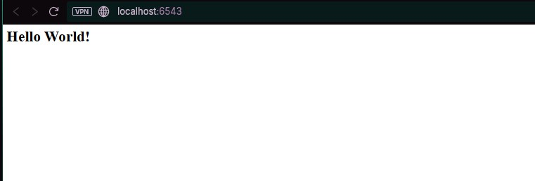

# 07: Basic Web Handling With Views (Penanganan Web Dasar dengan Views)

## Tujuan
Langkah ini berfokus pada organisasi kode yang lebih baik dengan memindahkan view callables ke modul terpisah (`views.py`) dan beralih ke konfigurasi deklaratif menggunakan `@view_config`.

- Memisahkan view logic ke modul `views.py`.
- Menggunakan `@view_config` decorator untuk konfigurasi deklaratif.
- Menggunakan `config.scan()` untuk otomatis mendaftarkan view dan route.
- Menambahkan view kedua dan memastikan pengujian fungsional mencakup tautan antar halaman.

## Hasil Aplikasi Utama

- URL: http://localhost:6543/

- URL: http://localhost:6543/howdy


## Perubahan Kode dan Konfigurasi

### 1. tutorial/__init__.py: Konfigurasi yang Lebih Ramping

```python
from pyramid.config import Configurator

def main(global_config, **settings):
    config = Configurator(settings=settings)
    # Menambah dua route
    config.add_route('home', '/')
    config.add_route('hello', '/howdy') 
    # Memindai modul views.py untuk decorator @view_config
    config.scan('.views') 
    return config.make_wsgi_app()
```

**Analisis:**
- `config.add_route(...)`: Tetap digunakan secara imperatif untuk mendefinisikan URL pattern.
- `config.scan('.views')`: Memindai modul Python dan otomatis mendaftarkan semua fungsi dengan decorator `@view_config`.

### 2. tutorial/views.py: Konfigurasi Deklaratif

```python
from pyramid.response import Response
from pyramid.view import view_config

# View pertama, diakses melalui route_name='home' (URL: /)
@view_config(route_name='home')
def home(request):
    return Response('<body>Visit <a href="/howdy">hello</a></body>')

# View kedua, diakses melalui route_name='hello' (URL: /howdy)
@view_config(route_name='hello')
def hello(request):
    return Response('<body>Go back <a href="/">home</a></body>')
```

**Analisis:**
- `@view_config(route_name='...')`: Konfigurasi deklaratif, metadata pendaftaran langsung di fungsi view.
- Keuntungan: View lebih mandiri dan mudah dibaca.

### 3. Pembaruan Pengujian

Tes diperluas untuk mencakup kedua view (home dan hello) di unit test dan functional test:

- **Unit Tests:** Menggunakan `testing.DummyRequest()` untuk memanggil fungsi `home()` dan `hello()` secara terpisah, memverifikasi kode status dan konten respons.
- **Functional Tests:** Menggunakan `TestApp.get('/')` dan `TestApp.get('/howdy')` untuk menguji routing dan memastikan konten HTML (termasuk link antar halaman) benar.

## Analisis Konsep Utama

### 1. Konfigurasi Imperatif vs. Deklaratif

| Tipe Konfigurasi | Metode | Lokasi | Kapan Digunakan |
|---|---|---|---|
| Imperatif | `config.add_view(...)` | Biasanya di `__init__.py` | Untuk konfigurasi dinamis atau kompleks |
| Deklaratif | `@view_config` | Di atas fungsi view | Untuk pendaftaran view yang jelas dan sederhana |

### 2. Konsep Decoupling
- `__init__.py` hanya bertanggung jawab untuk mendaftarkan route dan scan view.
- `views.py` hanya bertanggung jawab untuk logika view dan deklarasi pendaftarannya.

### 3. Fleksibilitas Penamaan
- Nama URL (`/howdy`), nama Route (`hello`), dan nama Fungsi View (`hello`) tidak harus sama. Memberikan fleksibilitas arsitektur URL.

## Kesimpulan

Langkah 07 merupakan langkah maju yang signifikan dalam mengorganisir kode Pyramid. Dengan memindahkan logika ke modul khusus dan mengadopsi konfigurasi deklaratif melalui `@view_config` dan `config.scan`, struktur proyek menjadi lebih bersih, mudah dibaca, dan mudah dikelola seiring pertumbuhan aplikasi.