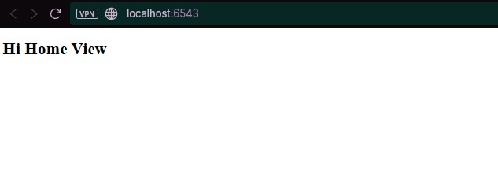

# Handling Web Requests and Responses (Penanganan Permintaan dan Respons Web)

Langkah ini mendalami cara Pyramid memproses permintaan masuk (Request) dan menghasilkan respons keluar (Response). Pyramid menggunakan pustaka WebOb yang matang untuk tujuan ini, memungkinkan kita mengakses data request dan memanipulasi header response dengan mudah.

## Tujuan Pembelajaran
- Memahami bahwa Pyramid menggunakan WebOb untuk objek Request dan Response.
- Mengakses data query string (parameter GET) melalui self.request.params.
- Menggunakan objek HTTPFound untuk melakukan HTTP Redirect.
- Membuat response kustom dengan header content_type yang spesifik.

## Hasil Aplikasi Utama

- URL yang Diakses: http://localhost:6543/


- URL yang Diakses: http://localhost:6543/howdy


- URL yang Diakses: http://localhost:6543/plain?name=alice redirect ke http://localhost:6543/plain


## Perubahan Kode dan Konfigurasi

### 1. tutorial/__init__.py: Route Sederhana
Route diperbarui menjadi hanya dua endpoint:

```python
# ...
config.add_route('home', '/')
config.add_route('plain', '/plain') # Route baru untuk view data
config.scan('.views')
# ...
```

### 2. tutorial/views.py: Logic Request/Response
Kelas view diubah untuk mendemonstrasikan redirection dan pengambilan data.

```python
from pyramid.httpexceptions import HTTPFound # <-- Import baru
from pyramid.response import Response
from pyramid.view import view_config

class TutorialViews:
    # ... (init method)

    @view_config(route_name='home')
    def home(self):
        # Mengembalikan objek HTTPFound untuk melakukan redirect (status 302)
        return HTTPFound(location='/plain') 

    @view_config(route_name='plain')
    def plain(self):
        # 1. Mengambil parameter GET 'name' dari request. Jika tidak ada, gunakan default.
        name = self.request.params.get('name', 'No Name Provided') 

        # 2. Membuat response body
        body = 'URL %s with name: %s' % (self.request.url, name)
        
        # 3. Mengembalikan Response kustom (bukan melalui renderer)
        return Response(
            content_type='text/plain', # Mengubah header Content-Type
            body=body
        )
```

Analisis Utama:

- HTTPFound(location='/plain'): Ini adalah objek Pengecualian HTTP Pyramid yang bertindak sebagai response. Ketika dikembalikan dari view, Pyramid mengintersepnya dan mengirim response HTTP 302 Redirect dengan header Location: /plain.
- self.request.params: Ini adalah atribut objek WebOb Request yang menyediakan dictionary gabungan dari parameter GET (query string) dan POST. Ini adalah cara yang andal dan umum untuk mengambil data form atau query string.
- Response(content_type='text/plain', ...): Kita membuat objek Response secara eksplisit untuk mengganti header Content-Type default (biasanya text/html) menjadi text/plain.

### 3. Pembaruan Pengujian
Tes Unit dan Fungsional diperbarui untuk memverifikasi fungsionalitas baru:

- Pengujian Redirection: Memastikan test_home mengembalikan response.status 302 Found.
- Pengujian Parameter: Membuat DummyRequest dengan dan tanpa request.GET['name'] untuk menguji view plain, dan WebTest digunakan untuk menguji URL dengan query string (/plain?name=...).

## Analisis Konsep Utama
1. Pyramid dan WebOb
   - WebOb: Pyramid bergantung pada pustaka WebOb untuk objek Request dan Response. Pustaka ini menyediakan API yang bersih dan konsisten untuk menangani Request mentah dari server WSGI dan membangun Response yang valid.
2. Respons Non-HTML
   - Meskipun renderer memudahkan pengembalian HTML, kita dapat selalu mengembalikan objek pyramid.response.Response secara eksplisit untuk endpoint API, konten plain text, atau data biner, memberikan kontrol penuh atas header respons (seperti Content-Type).
3. Kemudahan Pengambilan Data
   - Pengambilan data query string menggunakan .params sangat andal. Konstruksi self.request.params.get('name', 'No Name Provided') menunjukkan pola Python yang kuat untuk mengambil nilai dengan aman, menyediakan nilai default jika key tidak ditemukan.

## Kesimpulan
Langkah 10 memberikan pemahaman yang kuat tentang bagaimana Pyramid memfasilitasi dua komponen inti web: menerima data melalui WebOb Request (.params, .url) dan mengontrol response keluar, baik melalui redirection (HTTPFound) maupun response kustom (Response dengan content_type spesifik).
