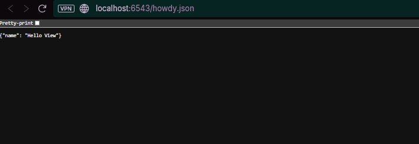

# 14 - AJAX Development With JSON Renderers

## Tujuan Pembelajaran
- Memahami bahwa renderer Pyramid tidak terbatas pada HTML templating.
- Menggunakan `renderer='json'` untuk mengubah dictionary Python menjadi respons JSON.
- Menggunakan teknik View Stacking (multiple `@view_config` pada satu view) untuk menangani format output yang berbeda.
- Memastikan bahwa Content-Type respons diatur dengan benar ke `application/json`.

## Hasil Aplikasi
Aplikasi kini memiliki endpoint baru yang mengembalikan data mentah dalam format JSON.
- **URL:** http://localhost:6543/howdy.json
- **Tampilan:**

- **Output:** `{"name": "Hello View"}`
- **Header:** Content-Type adalah `application/json`.

## Perubahan Kode dan Konfigurasi

### 1. `tutorial/__init__.py`: Route Baru
```python
# ...
config.add_route('home', '/')
config.add_route('hello', '/howdy')
config.add_route('hello_json', '/howdy.json') # <--- Route Baru
config.scan('.views')
# ...
```

### 2. `tutorial/views.py`: View Stacking
```python
# ...
class TutorialViews:
    # ...

    @view_config(route_name='hello') # View ini menggunakan default renderer: 'home.pt'
    @view_config(route_name='hello_json', renderer='json') # <--- Konfigurasi JSON
    def hello(self):
        # Logika View tetap sama: hanya mengembalikan data
        return {'name': 'Hello View'}
```
**Analisis:**
- View Stacking: Satu method dapat melayani beberapa route dengan renderer berbeda.
- Renderer Override: route_name='hello_json' menggunakan renderer='json'.
- Konsistensi Data: View hanya mengembalikan dictionary Python.

### 3. Pembaruan Pengujian
```python
    def test_hello_json(self):
        res = self.testapp.get('/howdy.json', status=200)
        self.assertIn(b'{"name": "Hello View"}', res.body) # Memverifikasi isi JSON
        self.assertEqual(res.content_type, 'application/json') # Memverifikasi header
```
**Analisis:**
- Tes ini memverifikasi isi JSON dan header Content-Type.

## Analisis Konsep Utama
1. **JSON Renderer (Tujuan dan Fungsi)**
   - Serialisasi: Mengubah dictionary Python menjadi string JSON.
   - Content Type: Otomatis mengatur header Content-Type ke `application/json`.
2. **View Agnostic Data**
   - View hanya mengembalikan data mentah, format output ditentukan oleh renderer.
3. **Alternatif Routing**
   - Bisa menggunakan predikat view untuk memilih renderer berdasarkan header Accepts:
   ```python
   @view_config(route_name='hello', renderer='json', accept='application/json')
   @view_config(route_name='hello', renderer='home.pt', accept='text/html')
   ```

## Kesimpulan
Langkah 14 berhasil menambahkan dukungan API berbasis JSON ke aplikasi Pyramid, menunjukkan betapa mudahnya mengadaptasi view yang ada untuk melayani berbagai format output melalui konfigurasi deklaratif (View Stacking dan renderer='json'). Ini adalah pola penting untuk membangun aplikasi hybrid (HTML + API).
