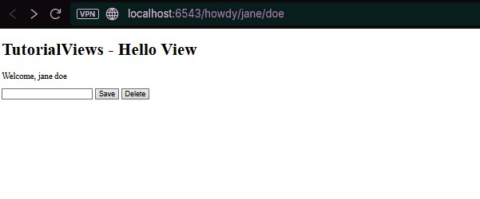

# Pyramid Quick Tutorial: Langkah 15

## More With View Classes (Fitur Lanjut Kelas View)

Langkah ini mendalami fungsionalitas View Class Pyramid, menunjukkan bagaimana satu route dapat dipetakan ke beberapa view method berdasarkan kriteria permintaan (view predicates), dan bagaimana state serta logika dapat dibagi di antara view dan template.

## Tujuan Pembelajaran
- Memusatkan pendaftaran route menggunakan `@view_defaults(route_name='...')`.
- Menggunakan View Predicates (`request_method`, `request_param`) untuk mendispatch permintaan ke view method yang berbeda.
- Berbagi State (`__init__`) dan Logika (`@property`) di antara view method dan template.
- Menggunakan `request.route_url()` untuk menghasilkan URL secara aman.

## Hasil Aplikasi
Aplikasi menampilkan form processing sederhana yang diatur oleh satu route utama (`hello`).
- **URL:** http://localhost:6543/howdy/jane/doe
- **Tampilan:**

- **Output Dinamis:** Welcome, jane doe (dari property `full_name`).
- **Interaksi:**
  - Klik Save: Memicu method `edit` (POST).
  - Klik Delete: Memicu method `delete` (POST + param `form.delete`).

## Perubahan Kode dan Konfigurasi

### 1. `tutorial/__init__.py`: Route Dinamis
```python
# ...
config.add_route('home', '/')
config.add_route('hello', '/howdy/{first}/{last}') # Route utama untuk beberapa views
config.scan('.views')
# ...
```

### 2. `tutorial/views.py`: Dispatching Berbasis Kelas
```python
from pyramid.view import view_config, view_defaults

@view_defaults(route_name='hello') # Default Route untuk semua method
class TutorialViews:
    def __init__(self, request):
        self.request = request
        self.view_name = 'TutorialViews' # Shared State

    @property
    def full_name(self): # Shared Logic
        first = self.request.matchdict['first']
        last = self.request.matchdict['last']
        return first + ' ' + last

    # View 1: Default/GET view
    @view_config(renderer='hello.pt')
    def hello(self):
        return {'page_title': 'Hello View'}

    # View 2: POST Edit
    @view_config(request_method='POST', renderer='edit.pt')
    def edit(self):
        new_name = self.request.params['new_name']
        return {'page_title': 'Edit View', 'new_name': new_name}

    # View 3: POST Delete
    @view_config(request_method='POST', request_param='form.delete', renderer='delete.pt')
    def delete(self):
        print('Deleted')
        return {'page_title': 'Delete View'}
```
**Analisis:**
- `@view_defaults(route_name='hello')`: Mengatur route default untuk semua method.
- View predicates (`request_method`, `request_param`) mengatur dispatching ke method berbeda.
- State dan property dapat diakses di semua method dan template.

### 3. Template dan URL Generation
- Template dapat mengakses state/property dari view class: `${view.view_name}`, `${view.full_name}`.
- `request.route_url('hello', first='jane', last='doe')` digunakan untuk generate URL secara aman.

## Analisis Konsep Utama
1. **View Predicates (Dispatching Cerdas)**
   - Satu URL/Route dapat dipetakan ke banyak method berdasarkan kondisi permintaan (HTTP method, parameter, dll).
   - Fondasi endpoint RESTful yang bersih.
2. **Berbagi State dan Logika**
   - Variabel di `__init__` dan property dapat diakses di seluruh siklus permintaan dan template.
3. **URL Generation yang Aman**
   - `request.route_url(...)` menjamin URL selalu benar meski pola route berubah.

## Kesimpulan
Langkah 15 menunjukkan bagaimana View Class adalah alat organisasi penting di Pyramid. Dengan view predicates dan state/logic sharing di tingkat kelas, pengembang dapat membangun controller yang kuat dan terorganisir, memetakan satu Route logis ke banyak operasi fungsional berbeda.
